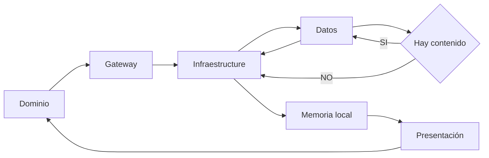
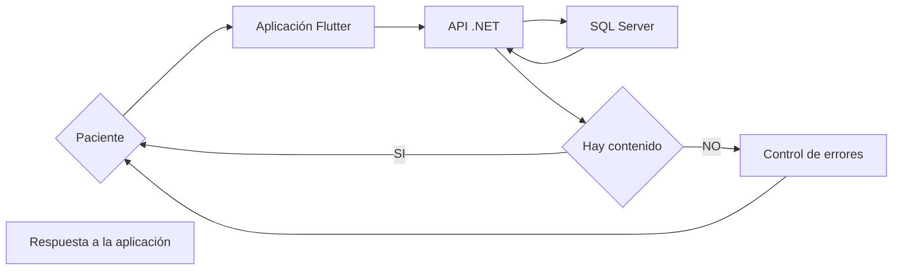

# README

```mermaid

graph LR;

D[Dominio]
A[Datos]
I[Infraestructure]
G[Gateway]
P[Presentación]
H{Hay contenido}
M[Memoria local]

P --> D
D --> G
G --> I
I --> A
A --> H

H --> |SI| A
H --> |NO| I

A --> I

I --> M
M --> P


```

```mermaid

graph LR;

P{Paciente}
F[Aplicación Flutter]
B[API .NET]
S[SQL Server]
R[Respuesta a la aplicación]
H{Hay contenido}
C[Control de errores]

P --> F
F --> B
B --> S
S --> B
B --> H

H --> |SI| P
H --> |NO| C

C --> P

```
